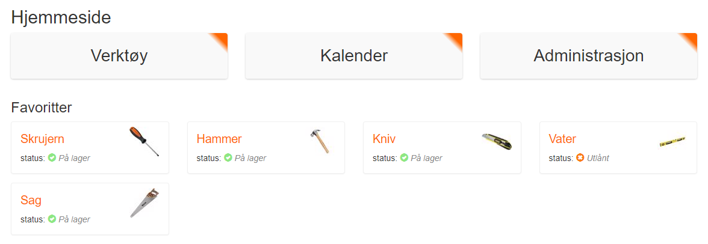

Developed a solution in the ASP.NET framework that allows the company and its employees to keep track of common tools. We have called the solution toolit. Toolit can be accessed by employees on mobile or PC, and lets them see which tools are on loan and who has them, without having to look in the warehouse themselves. The company also gets a simple overview of the use of the tools, which makes it easier to judge when and which tools the company should acquire.

# Home

# Admin dashboard

